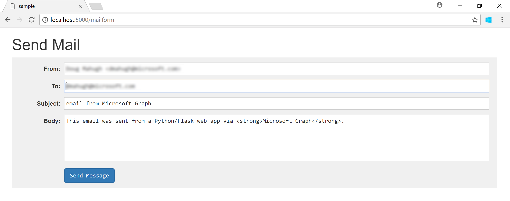
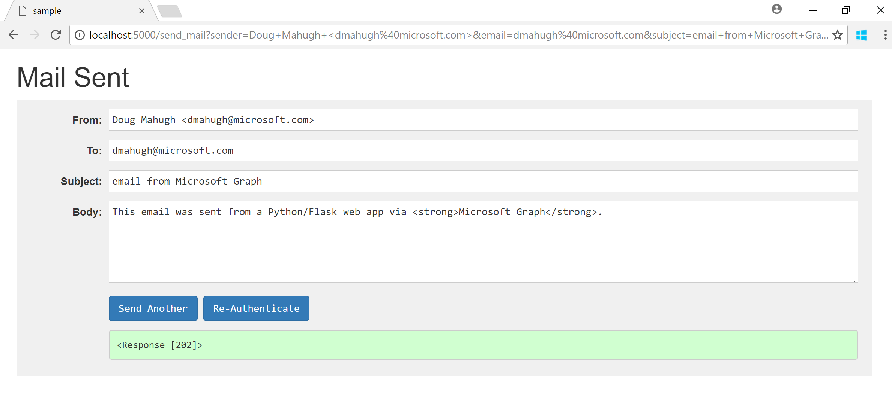
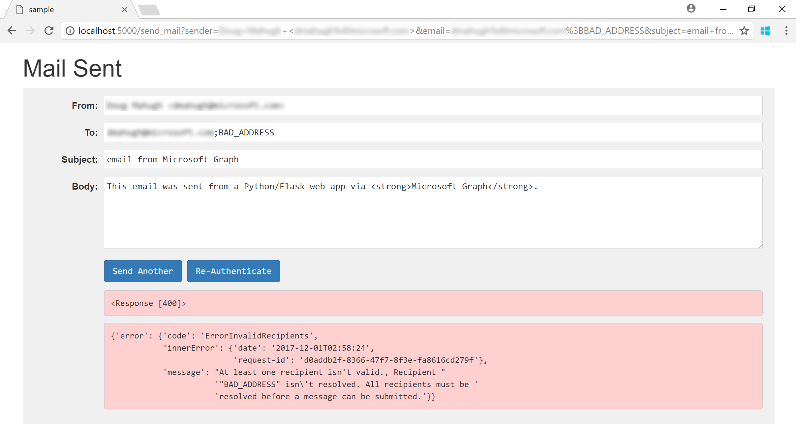

# Sending mail via Microsoft Graph from Python

  

Microsoft Graph provides [REST APIs for working with Outlook mail data](https://developer.microsoft.com/en-us/graph/docs/api-reference/v1.0/resources/mail_api_overview) that give your app the ability to perform user-centric actions such as sending and receiving email. This sample provides an example of how to send email from a Python web application, using the [Requests](http://docs.python-requests.org/en/master/) HTTP library to work with these Microsoft Graph APIs:

| API                 | Endpoint                                   |      |
| ------------------- | ------------------------------------------ | ---- |
| Get user profile    | /me                                        | [docs](https://developer.microsoft.com/en-us/graph/docs/api-reference/v1.0/api/user_get) |
| Get profile photo   | /me/photo                                  | [docs](https://developer.microsoft.com/en-us/graph/docs/api-reference/v1.0/api/profilephoto_get) |
| Upload to OneDrive  | /me/drive/root/children/{filename}/content | [docs](https://developer.microsoft.com/en-us/graph/docs/api-reference/v1.0/api/driveitem_put_content) |
| Create sharing link | /me/drive/items/{itemId}/createLink        | [docs](https://developer.microsoft.com/en-us/graph/docs/api-reference/v1.0/api/driveitem_createlink) |
| Send mail           | /me/microsoft.graph.sendMail               | [docs](https://developer.microsoft.com/en-us/graph/docs/api-reference/v1.0/api/user_sendmail) |

For additional information about this sample, see [Get started with Microsoft Graph in a Python app](https://developer.microsoft.com/en-us/graph/docs/concepts/python
).

* [Installation](#installation)
* [Running the sample](#running-the-sample)
* [Sendmail helper function](#sendmail-helper-function)
* [Contributing](#contributing)
* [Resources](#resources)

## Installation

To install and configure the samples, see the instructions in [Installing the Python REST samples](https://github.com/microsoftgraph/python-sample-auth/blob/master/installation.md). Note that the samples in this repo require **User.Read** and **Mail.Send** permissions.

After you've completed those steps, you'll be able to run the ```sample.py``` sample as covered below.

## Running the sample

1. At the command prompt: ```python sample.py```
2. In your browser, navigate to [http://localhost:5000](http://localhost:5000)
3. Choose **Connect** and authenticate with a Microsoft identity (work or school account or Microsoft account).

You'll then see a form that can be used to send email on behalf of the authenticated user:



By default, the email will be sent to the address of the authenticated user, but you can edit the To, Subject, and Body fields if desired. For multiple recipients on the To line, separate the email addresses with semicolons. Note that the Body field allows the use of HTML for formatting.

After you've made any edits to the email, choose **Send Message**. The email will then be sent via Microsoft Graph, and if all goes well an HTTP status code of 202 will be returned:



The [202 status code](http://www.w3.org/Protocols/rfc2616/rfc2616-sec10.html#sec10.2.3) is defined in the HTTP specification as follows:

> The request has been accepted for processing, but the processing has not been completed.
> The request might or might not eventually be acted upon, as it might be disallowed when processing actually takes place.

In other words, Graph has received and accepted our request to send an email. If the request was invalid, however, Graph may not accept it and then you'll get a different response. For example, here's what happens if you try to send to an invalid email address:



The [400 status code](http://www.w3.org/Protocols/rfc2616/rfc2616-sec10.html#sec10.4.1) means "The request could not be understood by the server due to malformed syntax." Note that a JSON error message is also returned, which describes the problem:

```javascript
{'error': {'code': 'ErrorInvalidRecipients',
           'innerError': {'date': '2017-12-01T02:58:24',
                          'request-id': 'd0addb2f-8366-47f7-8f3e-fa8616cd279f'},
           'message': "At least one recipient isn't valid., Recipient "
                      '"BAD_ADDRESS" isn\'t resolved. All recipients must be '
                      'resolved before a message can be submitted.'}}
```

This sample uses _delegated permissions_ to send mail on behalf of the currently authenticated user, identified as 'me' in Graph API calls. You can also send mail on behalf of other users, if you have administrator consent for the appropriate _application permissions_. See the [Microsoft Graph permissions reference](https://developer.microsoft.com/en-us/graph/docs/concepts/permissions_reference) for more information about Graph's permission model.

## Sendmail helper function

The ```sendmail()``` function in ```sample.py``` is a helper to make it easy to send email from Python applications and services via Microsoft Graph. For example, here's the line of code that sends mail in ```sample.py```, passing the values from the send mail form to the helper function:

```python
response = sendmail(client=MSGRAPH,
                    subject=flask.request.args['subject'],
                    recipients=flask.request.args['email'].split(';'),
                    body=flask.request.args['body'],
                    attachments=[profile_pic])
```

The helper function creates dictionaries for the recipients and any attachments, then assembles those into the JSON data that is sent to Graph. Here's the complete source code for ```sendmail()```:

```python
def sendmail(*, client, subject=None, recipients=None, body='',
             content_type='HTML', attachments=None):
    """Helper to send email from current user.

    client       = user-authenticated flask-oauthlib client instance
    subject      = email subject (required)
    recipients   = list of recipient email addresses (required)
    body         = body of the message
    content_type = content type (default is 'HTML')
    attachments  = list of file attachments (local filenames)

    Returns the response from the POST to the sendmail API.
    """

    # Verify that required arguments have been passed.
    if not all([client, subject, recipients]):
        raise ValueError('sendmail(): required arguments missing')

    # Create recipient list in required format.
    recipient_list = [{'EmailAddress': {'Address': address}}
                      for address in recipients]

    # Create list of attachments in required format.
    attached_files = []
    if attachments:
        for filename in attachments:
            b64_content = base64.b64encode(open(filename, 'rb').read())
            mime_type = mimetypes.guess_type(filename)[0]
            mime_type = mime_type if mime_type else ''
            attached_files.append( \
                {'@odata.type': '#microsoft.graph.fileAttachment',
                 'ContentBytes': b64_content.decode('utf-8'),
                 'ContentType': mime_type,
                 'Name': filename})

    # Create email message in required format.
    email_msg = {'Message': {'Subject': subject,
                             'Body': {'ContentType': content_type, 'Content': body},
                             'ToRecipients': recipient_list,
                             'Attachments': attached_files},
                 'SaveToSentItems': 'true'}

    # Do a POST to Graph's sendMail API and return the response.
    return client.post('me/microsoft.graph.sendMail',
                       headers=request_headers(),
                       data=email_msg,
                       format='json')
```

## Contributing

These samples are open source, released under the [MIT License](https://github.com/microsoftgraph/python-sample-pagination/blob/master/LICENSE). Issues (including feature requests and/or questions about this sample) and [pull requests](https://github.com/microsoftgraph/python-sample-pagination/pulls) are welcome. If there's another Python sample you'd like to see for Microsoft Graph, we're interested in that feedback as well &mdash; please log an [issue](https://github.com/microsoftgraph/python-sample-pagination/issues) and let us know!

This project has adopted the [Microsoft Open Source Code of Conduct](https://opensource.microsoft.com/codeofconduct/). For more information, see the [Code of Conduct FAQ](https://opensource.microsoft.com/codeofconduct/faq/) or contact [opencode@microsoft.com](mailto:opencode@microsoft.com) with any additional questions or comments.

## Resources

Documentation:
* [Use the Microsoft Graph API to integrate with Outlook mail](https://developer.microsoft.com/en-us/graph/docs/api-reference/v1.0/resources/mail_api_overview)
* Microsoft Graph [Send mail](https://developer.microsoft.com/en-us/graph/docs/api-reference/v1.0/api/user_sendmail) documentation
* [Microsoft Graph permissions reference](https://developer.microsoft.com/en-us/graph/docs/concepts/permissions_reference)

Samples:
* [Python authentication samples for Microsoft Graph](https://github.com/microsoftgraph/python-sample-auth)
* [Sending mail via Microsoft Graph from Python](https://github.com/microsoftgraph/python-sample-send-mail)
* [Working with paginated Microsoft Graph responses in Python](https://github.com/microsoftgraph/python-sample-pagination)
* [Working with Graph open extensions in Python](https://github.com/microsoftgraph/python-sample-open-extensions)

Packages:
* [Flask-OAuthlib](https://flask-oauthlib.readthedocs.io/en/latest/)
* [Requests: HTTP for Humans](http://docs.python-requests.org/en/master/)
